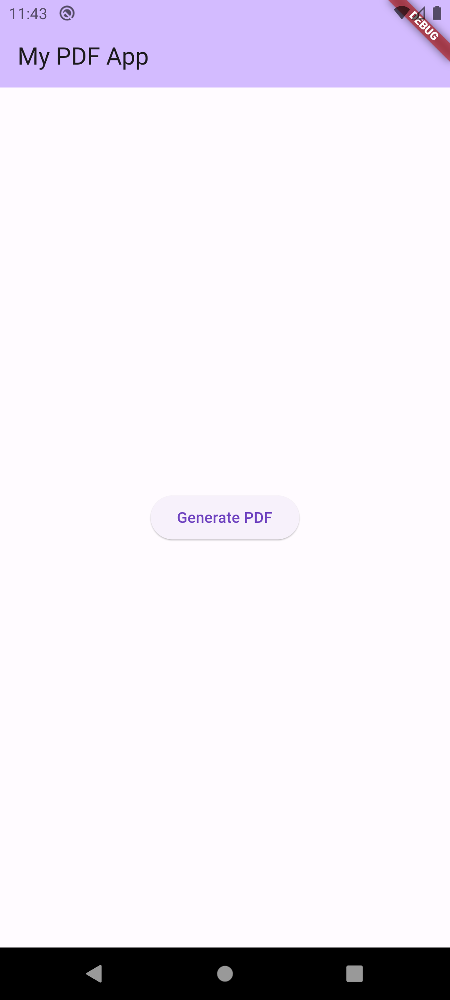
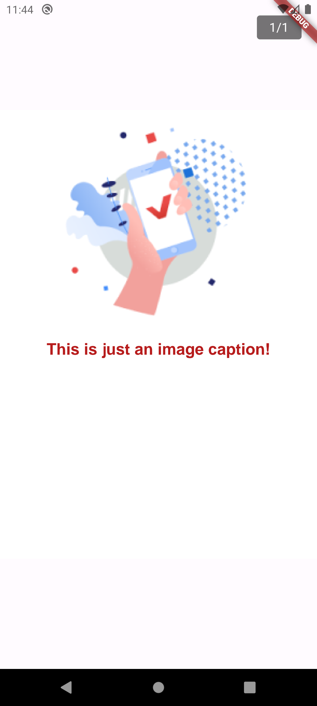

# Welcome to My PDF Example App

## What does the app do?

This app I wrote it and made it public as a support codebase for my article on Hashnode on [Producing PDFs within your Flutter App 1/2](https://jacksiro.hashnode.dev/producing-pdfs-within-your-flutter-app-1). This is a basic app that you can use to learn how to produce PDFs in your [Flutter](https://flutter.dev) app

## Look and Feel of the app
<table>
    <tr>
        <td></td>
        <td></td>
    </tr>
    <tr>
        <td><b>Image 1: Main Screen for PDF Generation</b></td>
        <td><b>Image 2: PDF Perview Screen</b></td>
    </tr>
</table>

## Getting Started

Here's a guide to help you get set up and running with the App:

### Setting Up the App:

1. **Install Flutter and Dependencies:** First, ensure you have Flutter installed on your system. Download the Flutter SDK from the [official website](https://flutter.dev) and follow the installation instructions for your specific operating system. Set up your preferred IDE (e.g., Android Studio or Visual Studio Code) with the Flutter plugin to streamline development.

2. **Clone the Repository:** Clone the Field Agent Insurance App repository from the version control system (e.g., GitHub) using Git. To download the codebase, open your terminal or command prompt and run 

        git clone https://github.com/JaxiroKe/my_pdf_app
        

3. **Install Packages:** Navigate to the project directory and run
        
        flutter pub get
to install all the required dependencies and packages mentioned in the `pubspec.yaml` file.

### Running the App:

1. **Device Setup:** Ensure you have an emulator or physical device connected to your development environment. To check connected devices, run:

        flutter devices
 in the terminal. If no devices are listed, start an emulator or connect a physical device via USB.

2. **Run the App:** To run the app, execute 
    
        flutter run
    in the terminal from the project directory. Flutter will build and install the app on the connected device. The app will launch, and you can interact with it on the emulator or physical device.

3. **Build the App:** There are 2 different app flavours that you build for to generate a release package
    - To build a release APK run

            flutter build apk --no-tree-shake-icons
        
    - To build a release App Bundle run

            flutter build appbundle --no-tree-shake-icons
        

Congratulations! You are now set up and running or building the PDF example App. You can start exploring the codebase, making modifications, and building new features to create a seamless experience. Happy coding!
